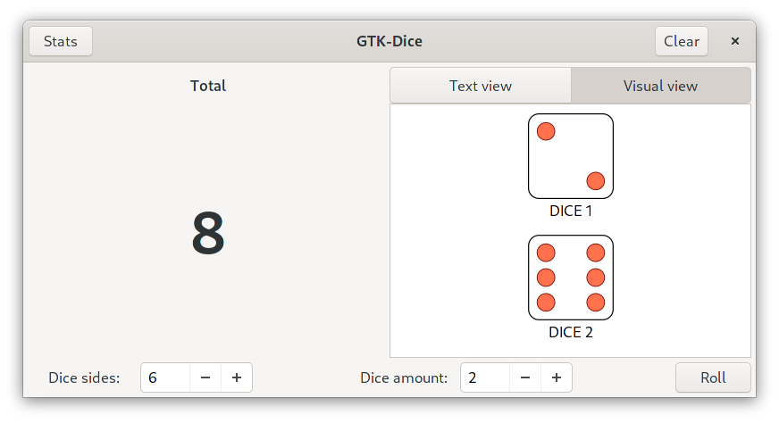

# GTK-Dice
A simple dice app for Linux+Gnome, built with GTK and C.

## Use
This app lets you roll up to 999 dice with up to 100 sides. The amounts are customisable.

Clicking the **stats** button pops up a dialog with a super simple bar chart showing the frequency of each roll total.

